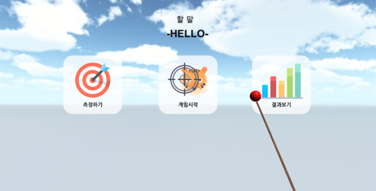
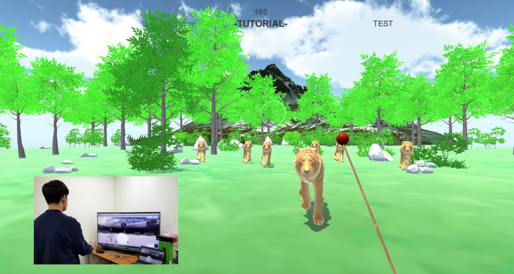
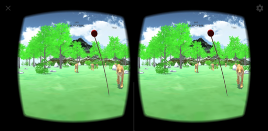
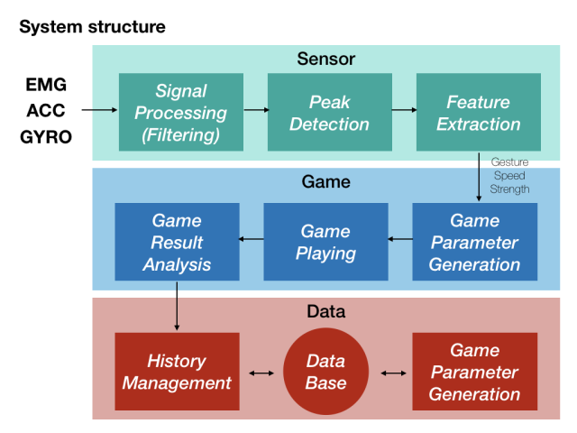

VRing-UP
==========
VRing-UP is a rehabilitation exercise application for stroke patient.  
VRing-UP can be installed on PC or Android smartphone.  
Myo smart band is required as a controller.  

Introduction
============
simple inroduction about VRing-UP
## Video

## Menu

### 1.Tutorial

사

Through tutorial, We can learn about basic operation. 
Also, Measuring patient conditions for setting game difficulties 

### 2.Game

You can run game on PC or Android samrtphone.  
If you have VR motion sickness, we recommend run on PC  

On Android smartphone, VR game are exectured.

## Architecture

## Development enviornment.

Unity 5.6.3f1(64-bit)  
Myo SDK  
Google VR SDK for unity  

Gachon univ. Dept. Software Team 8 Graduation Project
